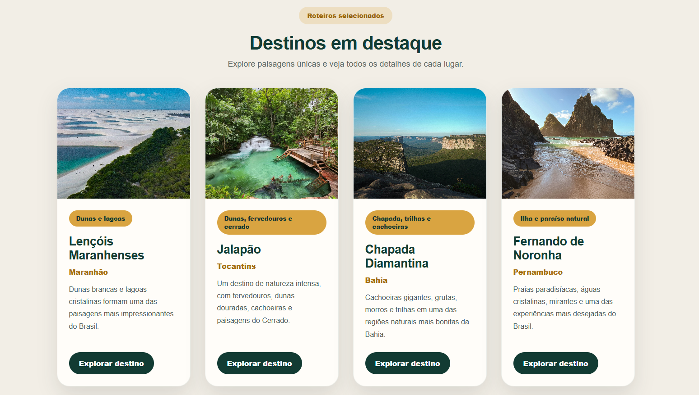
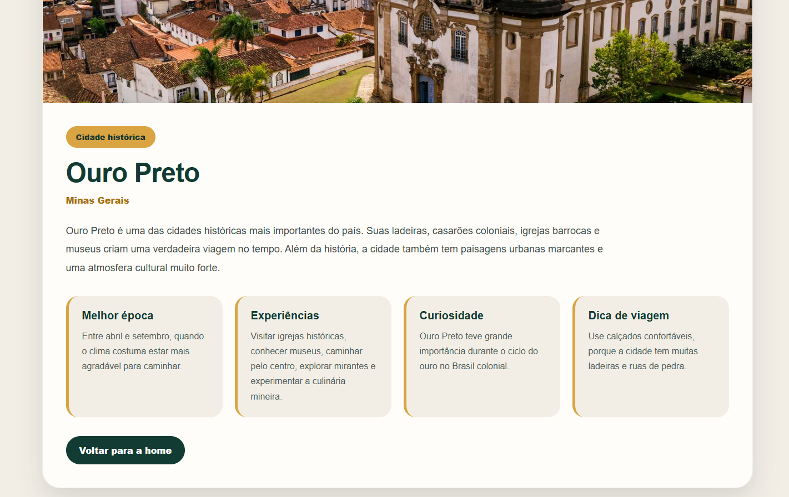

# Trabalho Prático - Semana 11

Nesta atividade, vamos dar continuidade ao projeto desenvolvido ao longo deste semestre, acrescentando a página de detalhes da aplicação.

Imagine que a página principal (home-page) mostre uma visão dos vários itens que existem no seu site. Ao clicar em um item, você é direcionado para a página de detalhes. A página de detalhes vai mostrar todas as informações sobre o item do seu projeto, seja esse item uma notícia, filme, receita, lugar turístico ou evento.

## Informações Gerais

- Nome: Pedro Henrique Santos de Jesus
- Matrícula: 1529847
- Descreva brevemente seu projeto: O Além da Vista foi desenvolvido com o objetivo de apresentar destinos brasileiros de forma visual, organizada e interativa. O projeto funciona como uma galeria digital de viagens, onde o usuário pode conhecer paisagens marcantes do Brasil, visualizar informações principais em cards e acessar uma página de detalhes com curiosidades, dicas e experiências recomendadas para cada local. A proposta é valorizar a diversidade natural e cultural do país, criando uma navegação simples e dinâmica.

## Prints do trabalho

## Home-Page




## TELA DE DETALHES



## Dados em JSON

```json
const destinos = [
    {
        id: 1,
        nome: "Lençóis Maranhenses",
        localizacao: "Maranhão",
        tipo: "Dunas e lagoas",
        resumo: "Dunas brancas e lagoas cristalinas formam uma das paisagens mais impressionantes do Brasil.",
        descricao: "Os Lençóis Maranhenses são um dos destinos naturais mais marcantes do país. Durante o período de chuvas, lagoas de água doce se formam entre as dunas, criando um cenário único, com aparência quase surreal. É um lugar perfeito para quem busca natureza, contemplação, fotografia e uma experiência diferente de qualquer outra paisagem brasileira.",
        melhorEpoca: "Entre junho e setembro, quando as lagoas estão mais cheias.",
        experiencias: "Caminhar pelas dunas, tomar banho nas lagoas, assistir ao pôr do sol e fazer passeios de 4x4.",
        curiosidade: "Mesmo parecendo um deserto, a região recebe chuvas que formam lagoas naturais entre as dunas.",
        dica: "Use roupas leves, leve água e prefira visitar no fim da tarde para aproveitar melhor a luz da paisagem.",
        imagem: "img/lencois-maranhenses.jpg"
    },
    {
        id: 2,
        nome: "Jalapão",
        localizacao: "Tocantins",
        tipo: "Dunas, fervedouros e cerrado",
        resumo: "Um destino de natureza intensa, com fervedouros, dunas douradas, cachoeiras e paisagens do Cerrado.",
        descricao: "O Jalapão é um dos destinos mais surpreendentes do Brasil. Localizado no Tocantins, reúne dunas douradas, rios cristalinos, cachoeiras, formações rochosas e os famosos fervedouros, onde a água impede que a pessoa afunde. É uma viagem perfeita para quem gosta de aventura, paisagens abertas e contato direto com a natureza.",
        melhorEpoca: "Entre maio e setembro, durante o período mais seco.",
        experiencias: "Conhecer fervedouros, visitar dunas, tomar banho em cachoeiras, fazer trilhas leves e apreciar o pôr do sol.",
        curiosidade: "Nos fervedouros, a pressão da água que nasce do solo cria uma flutuação natural.",
        dica: "Prepare-se para deslocamentos longos em estrada de terra e contrate passeios com guias experientes.",
        imagem: "img/jalapao.jpg"
    },
    {
        id: 3,
        nome: "Chapada Diamantina",
        localizacao: "Bahia",
        tipo: "Chapada, trilhas e cachoeiras",
        resumo: "Cachoeiras gigantes, grutas, morros e trilhas em uma das regiões naturais mais bonitas da Bahia.",
        descricao: "A Chapada Diamantina é um destino cheio de paisagens fortes e variadas. A região possui cachoeiras, grutas, poços de água cristalina, morros, trilhas e mirantes. É um lugar ideal para quem gosta de ecoturismo, aventura e cenários naturais que impressionam pela grandiosidade.",
        melhorEpoca: "Entre abril e outubro, quando o clima costuma favorecer trilhas e passeios.",
        experiencias: "Visitar a Cachoeira da Fumaça, conhecer o Morro do Pai Inácio, explorar grutas e tomar banho em poços naturais.",
        curiosidade: "A região recebeu esse nome por causa da exploração de diamantes no passado.",
        dica: "Monte um roteiro com calma, porque as atrações ficam espalhadas e muitas exigem deslocamento.",
        imagem: "img/chapada-diamantina.jpg"
    },
```


